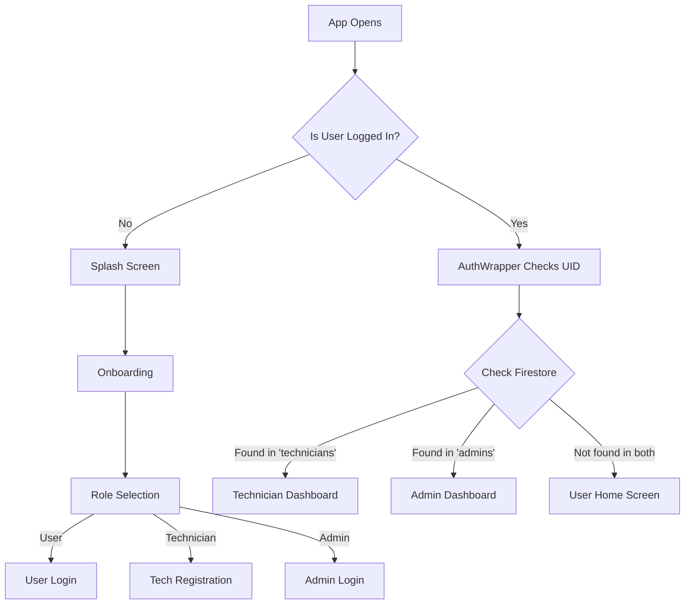
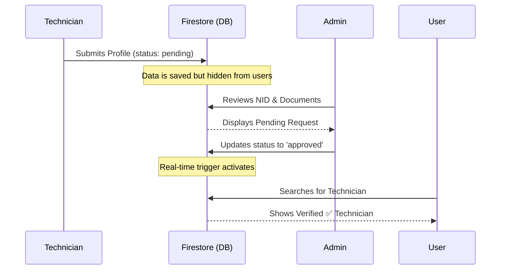

# ⚡ Sheba Finder BD
**A Trustworthy & Real-time Service Marketplace for Bangladesh**

[](https://flutter.dev)
[](https://firebase.google.com)
[](https://dart.dev)
[](https://opensource.org/licenses/MIT)

Sheba Finder BD is a robust, Flutter-based service marketplace platform designed to bridge the gap between skilled service providers (Technicians) and customers across Bangladesh. The system focuses on high-volume scheduling, real-time monitoring, dynamic role-based routing, and a "trust-first" approach to service delivery.

---

## 🏗️ System Architecture & Workflow

The platform utilizes a **Serverless BaaS (Backend as a Service)** model using Firebase, ensuring low latency and high scalability. To understand how the app works, let's break it down into three core workflows.

### 1. The Authentication & Role Routing Workflow (The Brain) 🧠
Unlike traditional apps that just log users in, Sheba Finder BD dynamically identifies who is logging in and routes them to the correct dashboard. We call this the `AuthWrapper` logic.

*   **Step 1:** User enters credentials. Firebase Authentication checks if the email/password is valid.
*   **Step 2:** If valid, the app takes the `uid` (User ID) and checks the `technicians` collection in Firestore.
*   **Step 3:** If not a technician, it checks the `admins` collection.
*   **Step 4:** If found in neither, it defaults to the `user` role.



### 2. The Trust & Verification Workflow (The Shield) 🛡️
To ensure safety, technicians go through a strict verification pipeline before appearing on the user app.

*   **Technician Applies:** Submits profile data, NID, and Trade License (Future scope).
*   **Admin Audit:** The application sits in a `pending` state. The Admin reviews the documents.
*   **Approval:** Admin updates Firestore status to `approved`. Instantly, the technician becomes visible to Users via `StreamBuilder`.



### 3. The Service & Rating Lifecycle (The Loop) 🔄
How a user finds a technician, books them, and rates them—creating a continuous ecosystem.

1.  **Discovery:** User filters by category (e.g., Plumber).
2.  **Availability Check:** App reads `isAvailable: true` from Firestore.
3.  **Booking:** User submits request. Technician toggles `isAvailable: false`.
4.  **Rating (Atomic Calculation):** Once service is done, the user rates (1-5). Instead of recalculating the whole average, we use **Atomic Updates** (`FieldValue.increment`) to safely update `totalRatingSum` and `ratingCount` in real-time without data conflicts.

---

## 🗄️ Database Architecture (Cloud Firestore)

We use a NoSQL document-based database. Here is how the data is structured so beginners can visualize it:

```json
🔥 Firestore Root
 │
 ├── 📂 users/ (uid)                 // Customer profiles
 │    └── name, email, phone
 │
 ├── 📂 technicians/ (uid)           // Provider profiles
 │    ├── name, category, experience
 │    ├── isAvailable: true/false    // Real-time toggle
 │    ├── status: "pending/approved" // Admin control
 │    ├── totalRatingSum: 15.0       // e.g., 4+5+6
 │    ├── ratingCount: 3             // 3 people rated
 │    ├── imageBase64: "..."         // Current image storage
 │    │
 │    └── 📂 ratings/ (userUid)      // Sub-collection for reviews
 │         └── rating: 5, ratedAt: timestamp
 │
 ├── 📂 admins/ (uid)                // Admin credentials
 │    └── role: "super_admin"
 │
 └── 📂 bookings/ (bookingId)        // Order details
      ├── userId, technicianId
      ├── priority: "Standard/Urgent"
      └── status: "Pending/Completed"
```

---

## 🎨 User-Centric Design (UX/UI)

The application follows a **"Modular Dashboard"** philosophy, ensuring that users, technicians, and admins have a clutter-free experience tailored to their needs.

*   **Dark Theme Psychology (`0xFF0F172A`):** We use a deep navy/midnight blue background. It reduces eye strain during nighttime service bookings and makes our primary accent color (Gold `0xFFFFC65C`) pop for important action buttons.
*   **Real-time Visual Indicators:** A custom `BlinkDot` animation signals when a technician is online and available, providing instant visual feedback to the user.
*   **Trust Badges:** Prominent display of `✅ Verified` badges builds user confidence. Only admins can grant this badge after NID verification.
*   **Frictionless Onboarding:** The "Choose Your Path" screen separates Users and Technicians immediately, preventing role confusion.
*   **Localized Experience:** Built specifically for the Bangladesh market, featuring local categories (e.g., Mestory), and upcoming local payment gateways (bKash/Nagad).

---

## 🛠️ Tech Stack & Integrations

| Layer | Technology | Purpose | Why we chose it |
| :--- | :--- | :--- | :--- |
| **Frontend** | Flutter (Dart) | Cross-platform UI | One codebase for Android, iOS & Web. Highly reactive. |
| **Database** | Cloud Firestore | Real-time NoSQL DB | Syncs data across User and Tech apps instantly (e.g., Availability toggle). |
| **Auth** | Firebase Auth | Secure Identity | Manages Email/Pass login; easily scalable to Phone OTP. |
| **State Mgmt** | StreamBuilder | UI Reactivity | Directly binds Firestore snapshots to UI, eliminating the need for complex state management boilers for real-time data. |
| **Animations** | Lottie | Micro-interactions | Makes the splash and onboarding screens feel alive and premium. |
| **Storage** | Firebase Storage (Upcoming) | Document Hosting | Will securely store NID and Trade License images for verification. |
| **Payments**| SSLCommerz / bKash (Upcoming) | Local Transactions | Secure local transaction handling for the Bangladesh market. |

---

## 🔮 Future Work & Roadmap

We are constantly evolving **Sheba Finder BD** to become the definitive service hub in Bangladesh. Our upcoming features focus on security, transparency, and technician empowerment.

*   [ ] **KYC Document Upload:** Implementing NID Card & Trade License upload via Firebase Storage for strict identity verification.
        
*   [ ] **Real-time Geolocation:** Integrating Google Maps/Mapbox API for live technician tracking from the user's end.
        
*   [ ] **Payment Gateway Integration:** Adding bKash/Nagad/SSLCommerz for secure in-app cashless transactions.
        
*   [ ] **Technician Profit Calculator:** A specialized Earnings Dashboard for technicians to track daily/weekly profits, order history, and withdrawal requests.
        
*   [ ] **In-App Chat:** Real-time messaging between user and technician to discuss problem details before arrival.
        
*   [ ] **Push Notifications (FCM):** Automated alerts for booking confirmation, technician arrival, and admin approval.

---

## ⚙️ Installation & Setup (For Developers)

Want to run this project locally? Follow these steps:

1.  **Prerequisites:** Make sure you have [Flutter SDK](https://flutter.dev/docs/get-started/install) installed on your machine.

2.  **Clone the Repo:**
    ```bash
    git clone https://github.com/your-username/sheba-finder-bd.git
    cd sheba-finder-bd
    ```

3.  **Install Dependencies:**
    ```bash
    flutter pub get
    ```

4.  **Firebase Setup:**
    *   Go to the [Firebase Console](https://console.firebase.google.com/) and create a new project.
    *   Enable **Authentication** (Email/Password).
    *   Enable **Cloud Firestore** (Start in test mode, then update security rules).
    *   Use the [FlutterFire CLI](https://firebase.flutter.dev/docs/cli) to configure Firebase automatically:
        ```bash
        dart pub global activate flutterfire_cli
        flutterfire configure
        ```
    *   This will automatically generate the `firebase_options.dart` file required for initialization.

5.  **Run the App:**
    ```bash
    flutter run
    ```

---
<div align="center">
  Built with ❤️ and ☕ using Flutter & Firebase
</div>
